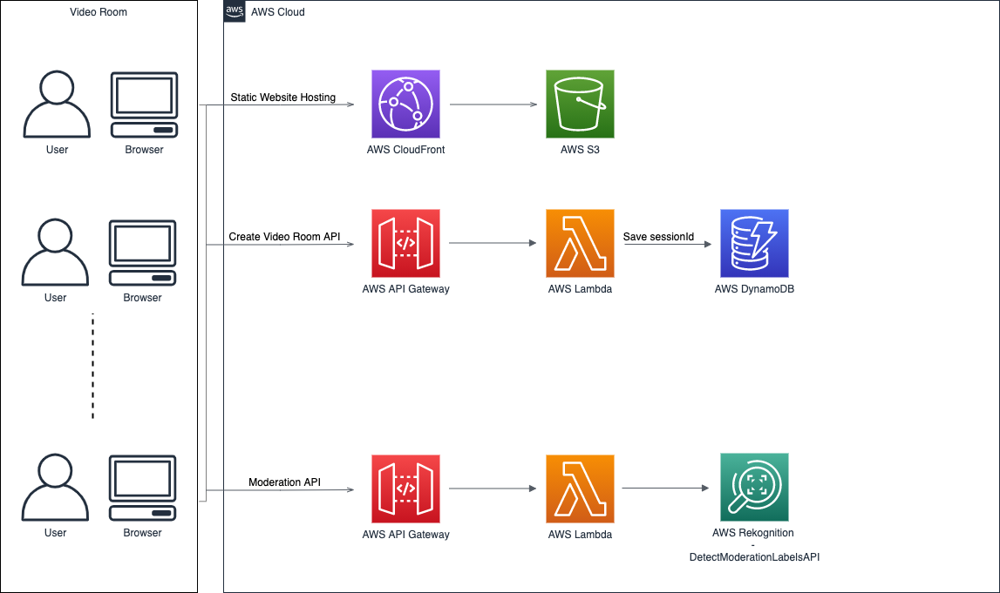

# Vonage Video API Moderation Demo

Vonage Video API Moderation Demo is a solution that leverages [Vonage Video API](https://www.vonage.co.uk/communications-apis/video/) and [AWS Rekognition](https://aws.amazon.com/rekognition/) to show how to moderatore video content published by a camera or a screen.

The application has the following features:

- detect innapropriate content published from the camera
- detect innapropriate content published from the screenshare of the device
- suppress offensive content when detected
- notify the participants of the call when innapropriate content is detected

## Architecture

The application backend is implemented using AWS Serverless components such as AWS Lambda, AWS API Gateway, AWS DynamoDB and AWS Rekognition service. The backend is deployed using the [Serverless Framework](https://www.serverless.com/).

### Backend

The backend is contained in the `src/functions` folder. There are two main functions: 

- `api/room.js`: handles the room creation in DynamoDB and assigns Vonage Video API sessionId to the specific room name
- `api/moderation.js`: receives the base64 image from the client, sends the image to the AWS Rekognition service and sends back the result to the client

For a full description, navigate to [Server Docs](./src/functions/README.md).

### Frontend

The frontend is a React Single page application. For a full description, navigate to [Client Docs](./src/client/README.md).

## Usage

### Prerequisites

To deploy the sample application, you will require: 

- Vonage Video API account: [https://www.vonage.co.uk/communications-apis/video/](https://www.vonage.co.uk/communications-apis/video/)
- AWS account: [https://aws.amazon.com](https://aws.amazon.com)

### Deployment

#### Server Side

The server side application uses the [Serverless Framework](https://www.serverless.com/) to deploy the AWS components such as AWS Lambda and AWS DynamoDB. 

To deploy the server side application, follow these steps:

1. Navigate to the server folder: `cd src/functions`
2. Run `npm install`
3. Run `serverless deploy` to deploy the app (https://www.serverless.com/framework/docs/providers/aws/cli-reference/deploy/). If you want to use a specific user for the deploy, add the `--aws-profile` option. Example: `serverless deploy --aws-profile enricop89`

#### Client Side

##### Local

If you want to test the client locally, follow the steps:

1. Copy `env.example` file to `.env`
2. Run `npm install`
3. Run `npm run start`

##### Prod

The client application is deployed on a S3 bucket and served by a CloudFront distribution. Once you have created the S3 Bucket and link it to the Cloudfront distribution, you can build the frontend app running `npm run build` on the `src/client` folder. After that, sync the content on the S3 bucket using `aws s3 sync` or uploading the content in the bucket. 

